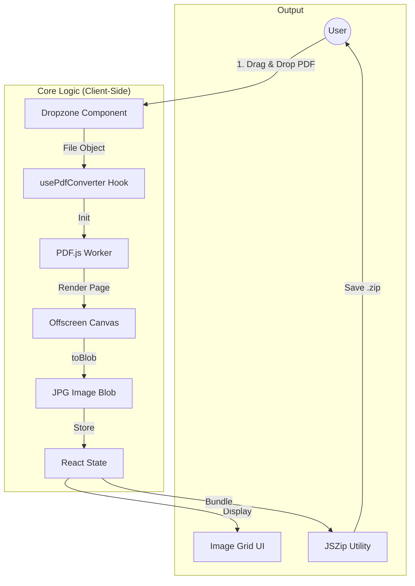

# PDF to JPG Converter Pro

This project allows you to convert PDF files to high-quality JPG images securely in your browser. All processing happens locally on your device; no files are uploaded to any server.

## Architecture & Workflow

## Run Locally

**Prerequisites:**  Node.js

1. Install dependencies:
   `npm install`

2. Run the app:
   `npm run dev`
