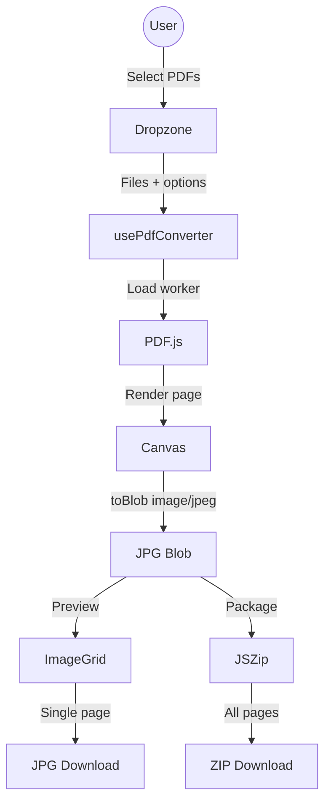

# PDF to JPG Converter Pro

PDF to JPG Converter Pro is a browser-only PDF conversion app. It converts PDF pages into JPG images on the user's device, with no file upload and no server-side document processing.

## Product Goal

Help privacy-conscious users convert one or more PDFs into downloadable JPG pages from a simple web app that also works as an installable PWA.

## Current Capabilities

- Drag-and-drop or file picker batch PDF upload.
- Forgiving PDF validation for `application/pdf` files and `.pdf` files with empty MIME types.
- Page range selection before conversion.
- Compact, standard, and high quality/DPI presets.
- Custom output base name with safe batch naming.
- Client-side PDF rendering with PDF.js.
- Sequential page conversion to JPG blobs.
- Progressive page preview while conversion is running.
- Cancel control for long conversions.
- Individual JPG download per page.
- ZIP download for all converted pages.
- Inline ZIP error recovery without browser alerts.
- PWA manifest, service worker, offline shell, privacy page, and terms page.
- GitHub Pages deployment workflow with install, typecheck, lint, audit, build, and smoke test steps.

## Known Product Limits

- Maximum upload size is 50 MB.
- PDFs are converted sequentially to reduce browser pressure.
- Very large page counts can still use significant browser memory.
- Browser compatibility still needs real-device checks, especially iOS Safari.
- No privacy-safe analytics are collected yet.

## Architecture



## Repository Guide

- `src/app/App.tsx` - main product screen and user flow composition.
- `src/components/` - upload, preview, modal, PWA, and error UI.
- `src/hooks/` - batch conversion, ZIP download, PWA install, and service worker update behavior.
- `src/lib/files/` - PDF validation and output filename helpers.
- `src/lib/pdf/` - PDF.js initialization, file reading, and page rendering helpers.
- `src/lib/pwa/` - service worker registration.
- `public/` - PWA manifest, service worker, static legal/offline pages, and icons.
- `build/` - build-time PWA precache plugin.
- `docs/` - product review, roadmap, and release quality notes.

## Run Locally

Prerequisite: Node.js 20 or newer is recommended because the GitHub Pages workflow uses Node.js 20.

```bash
npm install
npm run dev
```

The Vite dev server is configured for port `3000`.

## Build And Verify

```bash
npm run typecheck
npm run lint
npm run test:smoke
npm run build
npm audit
npm run preview
```

See [docs/QUALITY_RELEASE.md](docs/QUALITY_RELEASE.md) for the full release checklist.

## PWA Support

The app is installable and caches its app shell for offline launches after the first production load.

- Build production assets: `npm run build`
- Preview the production build: `npm run preview`
- PWA assets: `public/manifest.webmanifest`, `public/sw.js`, and `public/offline.html`
- Legal/static pages: `public/privacy.html` and `public/terms.html`
- User PDFs and generated JPG blobs stay in browser memory and are not intentionally persisted by the app.

## Product Docs

- [Product Review](docs/PRODUCT_REVIEW.md)
- [Roadmap](docs/ROADMAP.md)
- [Quality And Release](docs/QUALITY_RELEASE.md)

## License

MIT License.
